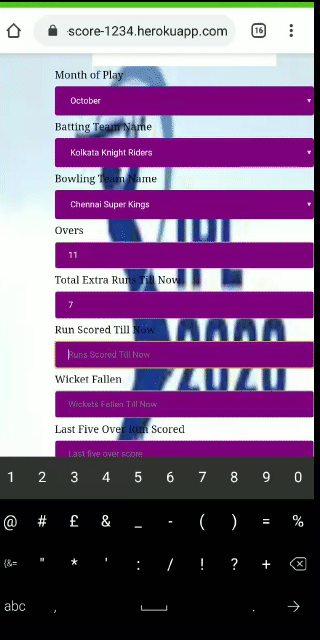

# IPL-First Innings Score Prediction
-------
### Table Of Content
1.Demo
2.Overview
3.Motivation
4.Technical Aspect
5.Technology Used
6.Team
7.Credits
#### Demo

- 
- If you want to view the app
[click here](https://ipl-first-innings-score-1234.herokuapp.com/)

- Here is the glimpse of how it looks

#### Overview
This Repository contains the codes for building a Machine Learning app which will predict first innings score.I have created this web app using FLASK and deployed it on heroku cloud

#### Motivation
As IPL is like a occasion in India,We not only love it but also live it.As we always try to bet with other about score of the innings in betwwen the match that things strike my mind so I come forward with this project

#### Technical Aspects
This is simple machine learning model.In this project I have Used [IPL Dataset](https://www.kaggle.com/nowke9/ipldata).This data contains ball by ball data from 2008 to 2019. As this is a messy data it took a long to perform data cleaning,feature engineering and feature transforming.Then I used simple Random Forest as it was giving better than others.Then I saved the model in Pickle file.Then I had to use FLASK which is a micro frame works to create web api.And at last I deployed it on Heroku Cloud Platform

#### Technology Used

